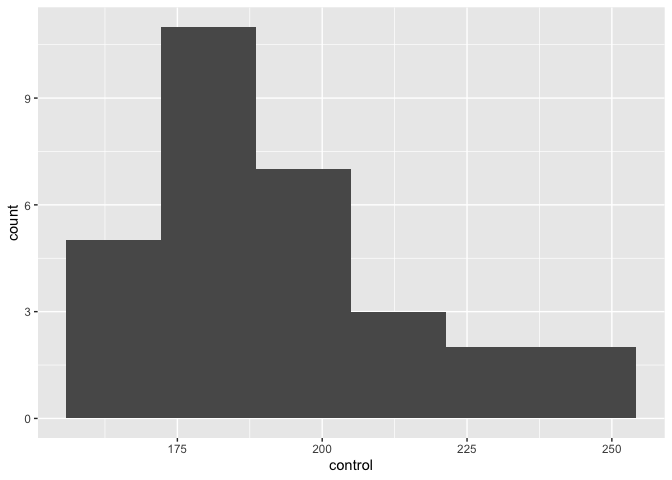
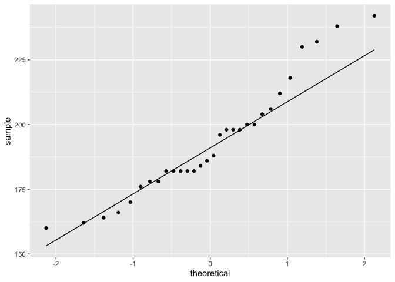
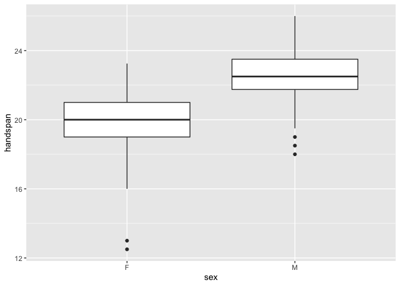
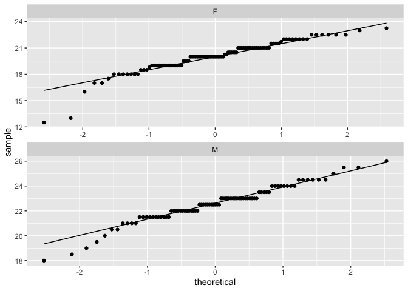

STAC32 Assignment 2
================

## Packages for Assignment 2

  - To work with the following data and complete the accompanying
    questions the tidyverse package must be
    loaded.

<!-- end list -->

``` r
library(tidyverse)
```

    ## ── Attaching packages ─────────────────────────────────────── tidyverse 1.3.1 ──

    ## ✓ ggplot2 3.3.3     ✓ purrr   0.3.4
    ## ✓ tibble  3.1.6     ✓ dplyr   1.0.7
    ## ✓ tidyr   1.1.4     ✓ stringr 1.4.0
    ## ✓ readr   1.4.0     ✓ forcats 0.5.1

    ## ── Conflicts ────────────────────────────────────────── tidyverse_conflicts() ──
    ## x dplyr::filter() masks stats::filter()
    ## x dplyr::lag()    masks stats::lag()

## Question 1

The data set at <http://ritsokiguess.site/STAC32/cholest.csv> contains
cholesterol measurements for heart attack patients (at several different
times) as well as for a group of control patients. We will focus on the
control patients in this question.

## Our Data

  - The cholesterol level of a group of control patients.
  - One quantitative variable, zero qualitative variables.
      - Quantitative: control (patient cholesterol level)

## Part (a)

  - Read in and display (some of) the data.
      - Begin with creating a temporary file to store and download the
        url remotely without having to actually download the file to my
        computer.
      - Then because this is a csv or comma separated values file the
        function `read_csv` must be used.
      - The data is then displayed to ensure it was read correctly.

<!-- end list -->

``` r
tf <- tempfile()
url <- "http://ritsokiguess.site/STAC32/cholest.csv"
download.file(url, tf, mode = "wb")
cholesterol <- read_csv(tf)
```

    ## 
    ## ── Column specification ────────────────────────────────────────────────────────
    ## cols(
    ##   `2-Day` = col_double(),
    ##   `4-Day` = col_double(),
    ##   `14-Day` = col_double(),
    ##   control = col_double()
    ## )

``` r
cholesterol
```

    ## # A tibble: 30 × 4
    ##    `2-Day` `4-Day` `14-Day` control
    ##      <dbl>   <dbl>    <dbl>   <dbl>
    ##  1     270     218      156     196
    ##  2     236     234       NA     232
    ##  3     210     214      242     200
    ##  4     142     116       NA     242
    ##  5     280     200       NA     206
    ##  6     272     276      256     178
    ##  7     160     146      142     184
    ##  8     220     182      216     198
    ##  9     226     238      248     160
    ## 10     242     288       NA     182
    ## # … with 20 more rows

  - For the remainder of this question we will only be focusing on the
    control patients group, as requested.

## Part (b)

  - Make a suitable plot of the cholesterol levels of the control
    patients, and comment briefly on the shape of the distribution.
      - Since we are only looking at the control group a suitable plot
        will be the histogram.
      - This histogram is ideal for plotting one quantitative
variable.

<!-- end list -->

``` r
ggplot(cholesterol, aes(x=control)) + geom_histogram(bins = (with(cholesterol, nclass.Sturges(control))))
```

<!-- -->

  - The histogram seems to be approximately normally distributed with a
    slight right skew.

## Part (c)

  - It is recommended that people in good health, such as the Control
    patients here, keep their cholesterol level below 200. Is there
    evidence that the mean cholesterol level of the population of people
    of which the Control patients are a sample is less than 200? State
    your conclusion in the context of the data.
      - We are looking to test the hypothesis that the control group
        patients have a cholesterol level below 200
          - The null hypothesis or Ho: μ = 200
          - The alternative hypothesis or Ha: μ \< 200
          - μ in this case is defined as the control patients sample
            average cholesterol level.
      - To test this hypothesis a one-sided one sample t-test will be
        computed using the `t_test` function.

<!-- end list -->

``` r
t.test(cholesterol$control, mu = 200, alternative = "less")
```

    ## 
    ##  One Sample t-test
    ## 
    ## data:  cholesterol$control
    ## t = -1.6866, df = 29, p-value = 0.05121
    ## alternative hypothesis: true mean is less than 200
    ## 95 percent confidence interval:
    ##      -Inf 200.0512
    ## sample estimates:
    ## mean of x 
    ##  193.1333

  - After completing the one-sample t-test on the control group the test
    statistics was found to be -1.69 and p-value to be 0.051.
      - This p-value is greater than the alpha boundary of 0.05.
      - As a result there is a failure to reject the null hypothesis.
      - We can conclude that there is no significant evidence to show
        that the average control patients cholesterol is below 200.
  - The 95% confidence interval is -Inf to 200.05..
      - Since the CI includes a number greater than 200 this agrees with
        the conclusion of the t-test that the control patients
        cholesterol is not less than 200.

## Part (d)

  - What could the population mean cholesterol level be? You might need
    to get some more output to determine this.
      - The `summarize` function can be used to find the mean
        cholesterol level of the control population.

<!-- end list -->

``` r
cholesterol %>% summarize(m=mean(control))
```

    ## # A tibble: 1 × 1
    ##       m
    ##   <dbl>
    ## 1  193.

  - The mean cholesterol level of the control population is 193.13.
  - As well we could find the mean from the output of the One-Sample
    t-test that was computed in part (c).

## Part (e)

  - (2 points) Explain briefly why you would be reasonably happy to
    trust the 𝑡 procedures in this question. (There are two points you
    need to make.)
      - I would be reasonably happy to trust the t process procedures
        because…
          - The data looks approximately normally distributed.
          - As well because of the central limit theorem minimizes any
            abnormal data points when utilising large data sets, as is
            being done in this case.

<!-- end list -->

``` r
ggplot(cholesterol,aes(sample=control))+stat_qq()+stat_qq_line()
```

<!-- -->

  - This quantile plot shows us that the data of control patients
    cholesterol level is indeed approximately normally distributed.
      - It does seem as if a couple of the large values extend way above
        the average line skewing it slightly, which is why the words
        “approximately” normally distributed are used to describe the
        data.
  - As well there are 30 independent data point utilised, which can be
    seen by looking at the number of rows within the data from in part
    (a).

## Question 2

Take your right hand, and stretch the fingers out as far as you can. The
distance between the tip of your thumb and the tip of your little
(pinky) finger is your handspan. The students in a Statistics class at
Penn State measured their handspans and also whether they identified as
male or female. The data are at
<http://ritsokiguess.site/STAC32/handspan.txt>, with handspans measured
in inches. Thinking of these as a random sample of all possible
students, is it true that males have a larger mean handspan than
females? This is what we will explore.

## Our Data

  - The handspan of males and female statistics students in inches.
  - One quantitative variable, and one qualitative variable.
      - Quantitative: handspan
      - Qualitative: sex

## Part (a)

  - Read in and display (some of) the data.
      - The data is a text file where values are separated by a space.
      - Therefore the best way to read in the data is using the
        `read_delim` function.

<!-- end list -->

``` r
handspan_url <- "http://ritsokiguess.site/STAC32/handspan.txt"
class_data <- read_delim(handspan_url, " ")
```

    ## 
    ## ── Column specification ────────────────────────────────────────────────────────
    ## cols(
    ##   sex = col_character(),
    ##   handspan = col_double()
    ## )

``` r
class_data
```

    ## # A tibble: 190 × 2
    ##    sex   handspan
    ##    <chr>    <dbl>
    ##  1 M         21.5
    ##  2 M         22.5
    ##  3 M         23.5
    ##  4 F         20  
    ##  5 F         19  
    ##  6 F         20.5
    ##  7 F         20.5
    ##  8 F         20.2
    ##  9 M         23  
    ## 10 M         24.5
    ## # … with 180 more rows

## Part (b)

  - Make a suitable graph of the two columns.
      - This data set contains one quantitative and one qualitative
        variable.
      - Therefore the suitable method of graphing is utilising a
        side-by-side boxplot.
      - The boxplot can be created using the `ggplot` and `geom_boxplot`
        functions.

<!-- end list -->

``` r
ggplot(class_data, aes(x=sex, y=handspan)) + geom_boxplot()
```

<!-- -->

  - We take note that there are outliers present for both groups.

## Part (c)

  - Run a suitable two-sample 𝑡-test to address the question of
    interest. What do you conclude, in the context of the data?
      - The question of interest proposed at the start of Question 2 is:
        is it true that males have a larger mean handspan than females?
      - We will be testing the hypothesis that males have a larger
        average handspan than females.
          - The null hypothesis or Ho: μmales = μfemales
          - The alternative hypothesis or Ha: μmales \> μfemales
          - μ in this case is defined as average handspan (of the
            indicated sex).
      - To test this hypothesis a one-sided Welch two sample t-test will
        be computed using the `t_test` function.

<!-- end list -->

``` r
t.test(handspan ~ sex, data = class_data, alternative = "less")
```

    ## 
    ##  Welch Two Sample t-test
    ## 
    ## data:  handspan by sex
    ## t = -10.871, df = 187.92, p-value < 2.2e-16
    ## alternative hypothesis: true difference in means is less than 0
    ## 95 percent confidence interval:
    ##       -Inf -2.154173
    ## sample estimates:
    ## mean in group F mean in group M 
    ##        20.01699        22.55747

  - After computing the two sample t-test the t-statistic was found to
    be -10.87 and the p-value to be \< 2.2e-16.
  - The p-value is lower than the alpha value of 0.05.
  - As a result the null hypothesis is rejected.
  - In the context of this data this suggests that males have a larger
    mean handspan than females.
  - The hypothesis is supported statistically\!

## Part (d)

  - Obtain a 90% confidence interval for the difference in mean handspan
    between males and females. Do you need to run any more code? Explain
    briefly.
      - The default confidence interval boundary is 95% in the t-test
        function.
      - Therefore we need to turn the last code again and alter the
        confidence level used to
90%.

<!-- end list -->

``` r
t.test(handspan ~ sex, data = class_data, alternative = "less", conf.level = 0.9)
```

    ## 
    ##  Welch Two Sample t-test
    ## 
    ## data:  handspan by sex
    ## t = -10.871, df = 187.92, p-value < 2.2e-16
    ## alternative hypothesis: true difference in means is less than 0
    ## 90 percent confidence interval:
    ##       -Inf -2.239924
    ## sample estimates:
    ## mean in group F mean in group M 
    ##        20.01699        22.55747

  - The 90% confidence interval obtained is -Inf to -2.239924.
  - The interval contains only negative values, which is consistent with
    our having rejected a null hypothesis of no difference in the
    handspan mean between the males and females.
  - No I do not think we need to run any more code as this is still in
    agreeance with the test and conclusions conducted in part (c)

## Part (e)

  - Explain briefly why you might have some concerns about the validity
    of the 𝑡-tests you ran in this question. Or, if you don’t have any
    concerns, explain briefly why that is.
      - To assess if there should be any concerns we need to check the
        two assumptions that were used when undergoing the hypothesis
        testing.
          - One assumption is that there is that both groups are
            approximately normally distributed
          - The other assumption is that we have a large enough sample
            size to satisfy the central limit theorem.
              - Central limit theorem states that a large enough sample
                size can make a given data set approximately normal,
                even if it is somewhat non-normal.
      - This can be checked by computing a quantile plot, looking at the
        means and standard deviation of the groups, and by counting the
        number of data
points.

<!-- end list -->

``` r
ggplot(class_data, aes(sample = handspan)) + stat_qq() + stat_qq_line() +
  facet_wrap(~sex, scales = "free", ncol = 1)
```

<!-- -->

``` r
class_data %>% group_by(sex) %>% 
  summarize(count=n(), mean_handspan=mean(handspan), standard_deviation_handspan=sd(handspan))
```

    ## # A tibble: 2 × 4
    ##   sex   count mean_handspan standard_deviation_handspan
    ##   <chr> <int>         <dbl>                       <dbl>
    ## 1 F       103          20.0                        1.76
    ## 2 M        87          22.6                        1.46

  - We see through the quantile plot that the data for both groups is
    approximately normal. There is some concern of outliers at the lower
    end handspan length for both male and females groups. However if the
    central limit theorem is satisfied this will not be a major concern
    as overall the data will be approximately normal.
  - When looking at the summary of mean and standard deviation of both
    groups we see that the males mean is lower than the females, and
    that the standard deviations of either group doesn’t overlap with
    the mean of the other.
      - This validates the t-tests result.
  - As well the count shows us that there were 103 females and 87 males
    accounted for in the data set. These are big numbers, showing us
    that the central limit theorem can be thought of to be true.
      - This ensures that the non-normal, outlier data points seen in
        the quantile plot does not have the weight to pull the entire
        data set into non-normal distribution.
  - Although there were some concerns we can say that they are not
    significant enough to question the validity of the t-test result.
